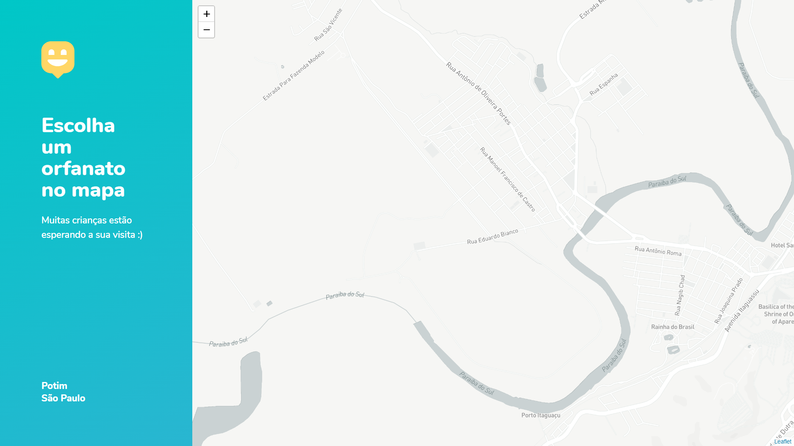

<h3 align="center">
    
    <br>
</h3>
<p align="center"> 🚀 <strong>Happy</strong>
 </p>

<p align="center">
   
  <a href="https://github.com/guilhermeorcezi/verzel-tasks#readme">
    
  </a>
  <a href="https://github.com/guilhermeorcezi/verzel-tasks/graphs/commit-activity">
    
  </a>
  <a href="https://github.com/guilhermeorcezi/verzel-tasks/blob/master/LICENSE">
    
  </a>
</p>

# :pushpin: Table of Contents

- [About](#sobre)
- [Technologies](#tecnologias-utilizadas)
- [How to run](#como-usar)
- [How to Contribute](#como-contribuir)

<a id="sobre"></a>

## :bookmark: About

<strong>Happy</strong> is a project to help you find orphanages in your area to make kids happy

## :rocket: Technologies

The project was developed using the following technologies

- [TypeScript](https://www.typescriptlang.org/)
- [React](https://pt-br.reactjs.org/)
- [Styled Components](https://styled-components.com/)

### Web Screenshot
<div style="display: flex; flex-direction: 'row'; align-items: 'center';">
       
       
</div>

## :fire: How to run

### :exclamation: Back-End (API server)
Clone the project on your computer. To install the dependencies and run the **Server** (development mode) execute after create an `happy` db on Postgres:
```bash
cd server
yarn typeorm:migration run  // creating the tables on happy table with postgres
yarn install // npm install
yarn dev:server // npm dev:server
```

### :exclamation: Front-End (Web Application)
To start the **application** clone this repository. Create a `.env` file using `.env.example` as example and set an MapBox token there, then use the commands bellow
```bash
cd web
yarn install // npm install
yarn start // npm start
```
After the process is over the `localhost: 3000` page containing the developed project will automatically open in your browser.

### :recycle: How to contribute
- First, leave a ⭐ if you like it!
- Fork this repository;
- Create a branch with your feature: `git checkout -b my-feature`
- Commit your changes: `git commit -m 'feat: My new feature'`
- Push your branch: `git push origin my-feature`

## :memo: License

This project is under the MIT license. See the [licence page](https://opensource.org/licenses/MIT) for more details.

---

<h4 align="center">
    Made with 💜 by <a href="https://www.linkedin.com/in/guilherme-orcezi" target="_blank">Guilherme Orcezi</a>
</h4>
